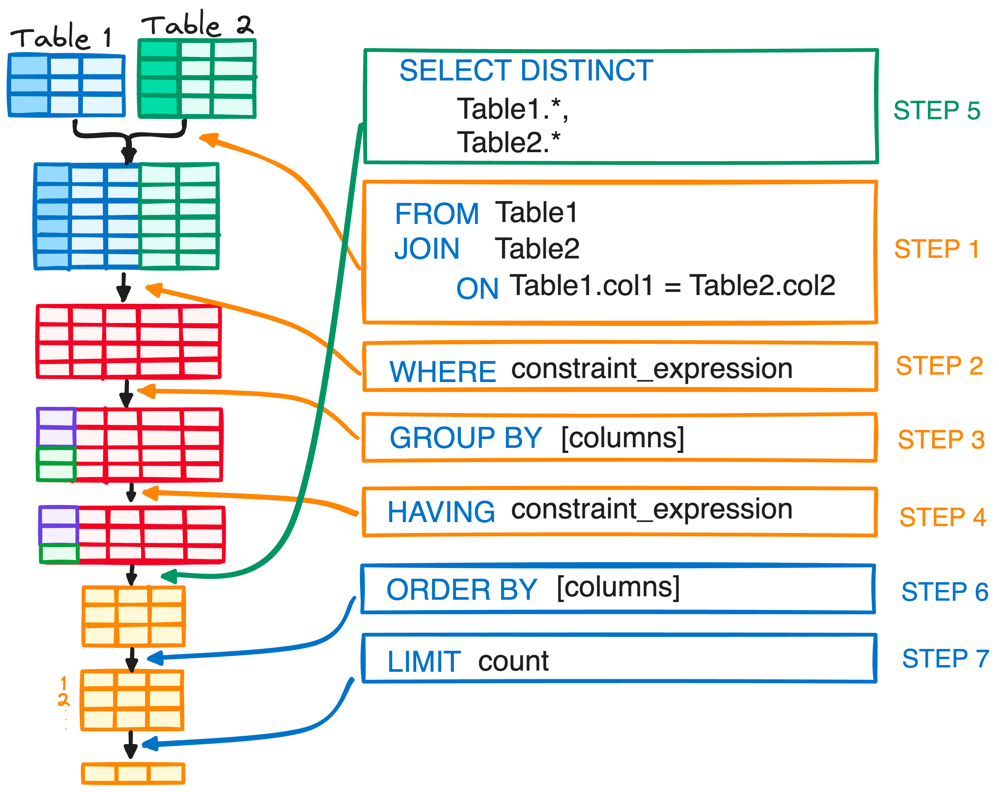

# 🧩 SQL Joins Simplified (Part - 2)

[Click here](https://www.linkedin.com/posts/pravesh-agarwal27_%F0%9D%90%96%F0%9D%90%9A%F0%9D%90%A7%F0%9D%90%AD-%F0%9D%90%AD%F0%9D%90%A8-%F0%9D%90%80%F0%9D%90%9C%F0%9D%90%9E-%F0%9D%90%92%F0%9D%90%90%F0%9D%90%8B-%F0%9D%90%88%F0%9D%90%A7%F0%9D%90%AD%F0%9D%90%9E%F0%9D%90%AB-activity-7260519232256233473-7XoH?utm_source=share&utm_medium=member_desktop) to access Day 2 LinkedIn Post.

## 👉 Today's Topic 

### - SQL Query Order of Execution:
Understanding the order in which SQL statements are executed is essential for writing accurate queries. Refer to the image below for a clear breakdown of each step.

